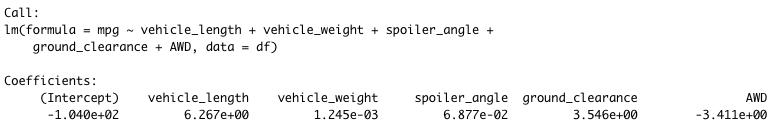
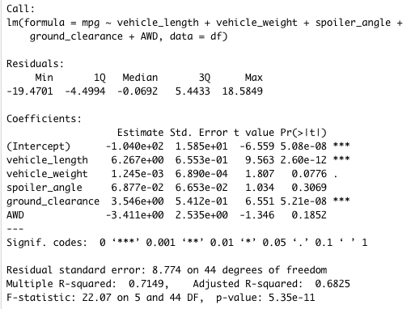
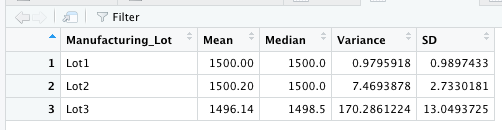
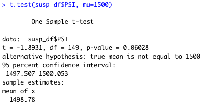
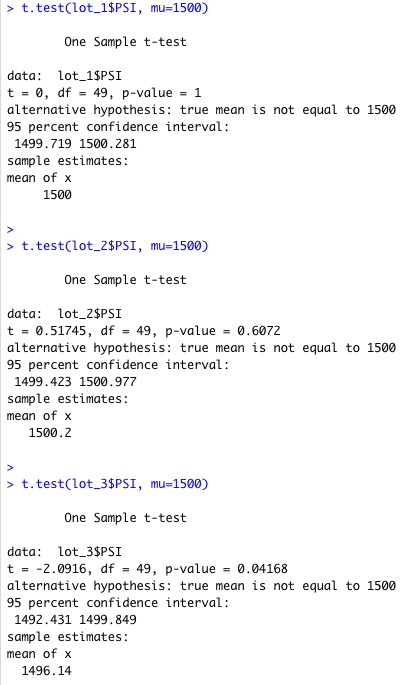

# MechaCar_Statistical_Analysis

Statistical Summary below...

## Linear Regression to Predict MPG

1. The vehicle length, and ground clearance are most likely to provide non-random amounts of variance to the model. This can be seen from the chart above.  This means the vehicle length and ground clearance have a significant impact on miles per gallon on the MechaCar. Other variables have a random amount of variance.

1. The assumed significance level is 0.05% and our 5 value is 5.35e-11. A much lower p-value than our significance level means we can reject the null hypothesis and that the slope is not zero  

1. We arrived at an R-squared value of 0.7149. This means 71.5% can be determined. Unfortunately this multiple regression model does not predict the MechaCar protoypes effectively.

## Summary Statistics on Suspension Coils

The design specifications for the MechaCar suspension coils dictate that the variance of the suspension coils must not exceed 100 pounds per square inch. The variance of the coils as shown in image 3 is well under the 100 PSI rewuirement  

Lot 1 and 2 are well within with a variance of 0.98 and 7.47 respectively. Therefore Lot 1 and Lot 2 meet the design spcification wheres, Lot 3 does not with a PSI variance of 170

## T-Tests on Suspension Coils

Using the presumed population mean of 1500, we find the following:

A summary of the t-test results of all the manufaturing lots shows that we have a true mean of 1498.78. We also have p-value of 0.06 which is higher than our significance level of 5%. Overall this means that the mean of all the manufactuting lots is statistically close to the presumed mean at 1500. With a p-value higher than the 5% significance level. We cannot reject the null hypothesis.

The image above shows the T-test results for the 3 different lots individually. From this analysis we are able to see that:

1. Lot 1 has a p-value of 1 indicating that Lot 1 actually has a true sample mean of 1500. Obviously we cannot reject. 

1. Lot 2 has a p-value of 0.61  with a true mean of 1500.2. The null hypothesis can't be rejected. the sample mean and population mean are statistically similar.

1. Lot 3 takes a different route than the earlier lots. we have a low p-value of 0.04 and a sample mean of 1496.14. We can hence reject the null hypothesis because the p-value is lower than our accepted significance level. 

## Study Design: MechaCar vs Competition
This study would involve collecting data on MechaCar and comparable models from different competitors.

Collecting data for comparable models across other competitiors for the following metrics:

Metrics
1. Selling Price
1. Horse Power
1. Maintenance Cost 
1. Lifespan of cars
1. Safety Feature Rating
1. Resale Value

Hypothesis: Null and Alternative
Null Hypothesis (Ho): MechaCar is priced correctly based on its performance and life cycle.
Alternative Hypothesis (Ha): MechaCar is NOT priced correctly based on performance and life cycle.

Statistical Tests
Multiple Linear regressions to see correletion with the selling price and other factors with different models as well. 
